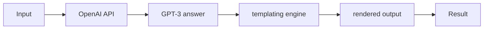

# Ava

**Work in progress:** Based on the GPT-3 ([OpenAI API](https://beta.openai.com/docs/api-reference/introduction)) and uses JavaScript Virtual Machine with templating techniques to extend it's abilities. Probably this is the easiest way to create your own virtual assistant that can be extended using simple human language and extended VM context.

## Why?

For fun and to learn more about GPT-3 and it's capabilities and use cases.

## Quick overview



### Weather example

You can take a look at the code here: [`examples/cli.ts`](examples/cli.ts)

```typescript
const vmModules: VMModule[] = [
  {
    id: 'weather',
    gpt3: {
      context: [
        '{{ weather }} variable is available in the context, it contains today weather forecast from openweathermap.'
      ],
      examples: [
        {
          human: 'What is the temperature?',
          ai: 'Temperature is {{ weather.temp.cur }}°C.'
        },
        {
          human: 'What is the wind speed?',
          ai: 'Wind speed is {{ weather.wind.speed }} m/s.'
        }
      ]
    },
    vm: {
      context: {
        weather: (await openWeather.getCurrent()).weather
      }
    }
  }
]

const middlewares = [getVMMiddleware(vmModules)]

const context = ['Your name is Ava.']

const examples: Example[] = [
  { human: 'Your name?', ai: 'My name is Ava.' }
]
```

Let's try it:

```typescript
const output = await ask(
  "Hey! What's your name? What's the temperature feels like outside? Also can you tell me wind speed?",
  {
    context,
    examples
  },
  middlewares
)

console.log(output)
```

Output:

```text
Hi there! My name is Ava. Temperature feels like 2.94°C and wind speed is 1.03 m/s.
```

## TODO

- [ ] Add more examples
- [ ] Create an documentation
- [ ] Create a adapters for other platforms (Telegram, Discord, Slack, etc.)

## Legal

This project is not affiliated with OpenAI in any way.

[Licensed under GPL-3.0](LICENSE): feel free to use code in your projects, but please provide a link to [this repository](https://github.com/0x77dev/ava).

Copyright © 2023 Mykhailo Marynenko <mykhailo@0x77.dev>
